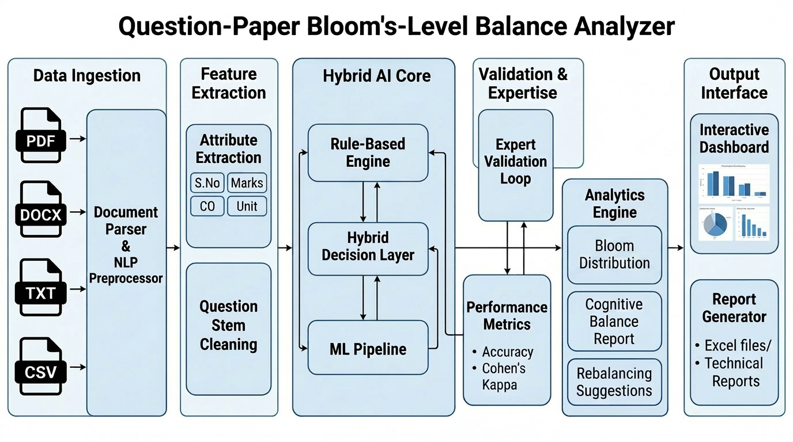
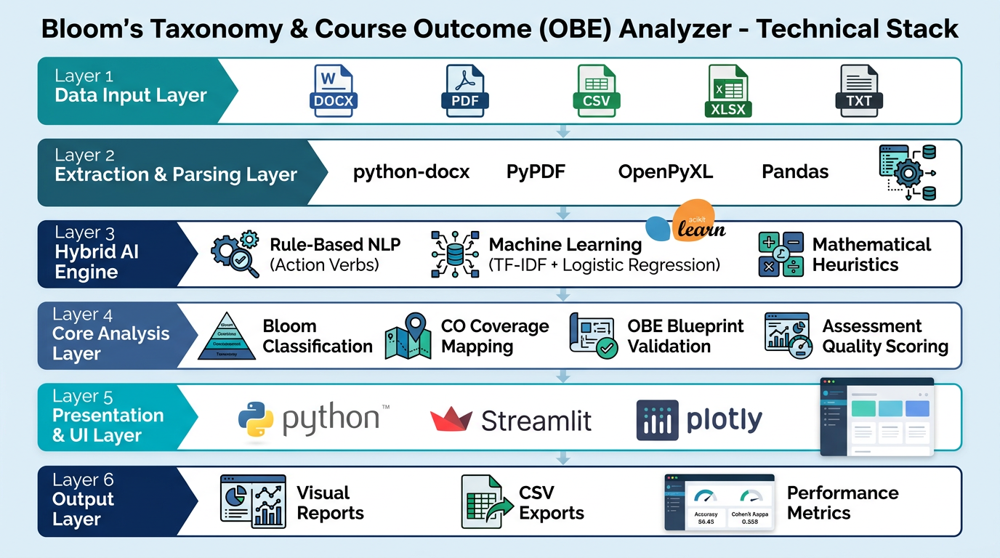

# Team: IntelliSphere 🌸 Bloom's Taxonomy & Course Outcome Analyzer

<p align="center">
<a href="https://bloomsanalyzerfinalhackathoncode-kpskpcgdrrzswupec9jpw8.streamlit.app/" target="_blank">

</a>
</p>
<p>
 <b> 📖 Overview</b>

The **Bloom's Taxonomy & Course Outcome (OBE) Analyzer** is an AI-powered assessment quality evaluation platform developed to support **Outcome-Based Education (OBE)** in higher education institutions. The application automatically analyzes examination question papers by classifying questions according to the **Revised Bloom's Taxonomy**, evaluating **Course Outcome (CO) coverage**, validating **OBE assessment blueprints**, and generating comprehensive analytics to improve assessment quality.

The proposed framework integrates **Rule-Based Natural Language Processing (NLP)**, **Machine Learning (TF-IDF + Logistic Regression)**, **action verb analysis**, and **mathematical heuristics** to provide reliable Bloom-level prediction and assessment validation. The system supports multiple input formats including **DOC, DOCX, PDF, CSV, XLSX, and TXT**, making it suitable for analyzing existing university question papers without requiring manual preprocessing.

Designed for faculty members, accreditation teams, and academic quality assurance units, the analyzer assists in creating balanced assessments that promote **Higher-Order Thinking Skills (HOTS)** while ensuring compliance with **NBA**, **NAAC**, and **Outcome-Based Education (OBE)** requirements.

The application also includes expert validation, assessment quality metrics, cognitive balance analysis, interactive dashboards, and downloadable reports, enabling educators to make evidence-based decisions during examination design and curriculum review.
</p>


<h2 align="center">🚀 Run the Project</h2>

<p align="center">

<a href="https://bloomsanalyzerfinalhackathoncode-kpskpcgdrrzswupec9jpw8.streamlit.app/" target="_blank">

</a>

&nbsp;&nbsp;

<a href="https://colab.research.google.com/github/YOUR_USERNAME/YOUR_REPOSITORY/blob/main/Question_PAper_Blooms_Analyzer_IntelliSphere.ipynb" target="_blank">

</a>

</p>
---

## 🏗️ System Architecture

<p align="center">
  
</p>

# 💻 Technology Stack

<p align="center">
  
</p>

<p align="center">
<b>Figure.</b> Technology stack of the Bloom's Taxonomy & Outcome-Based Education (OBE) Analyzer.
</p>

The proposed system integrates modern AI, Natural Language Processing, Machine Learning, and data visualization technologies to automate Bloom's Taxonomy classification and Outcome-Based Education (OBE) assessment analysis. The technology stack combines rule-based NLP, TF-IDF with Logistic Regression, interactive Streamlit dashboards, and comprehensive analytics to support intelligent examination quality assessment.

# Key Features

## Intelligent Question Paper Analysis

Supports multiple input formats:

* DOC
* DOCX
* PDF
* CSV
* XLSX
* TXT

The system automatically:

* Extracts questions from uploaded files
* Removes duplicate questions
* Eliminates OR-choice questions
* Detects question numbering
* Extracts marks automatically
* Identifies Course Outcomes (COs)
* Recognizes question types

Supported question categories include:

* Theory Questions
* Programming Questions
* Numerical Problems
* Mathematical Questions
* Case Study Questions
* Design-Oriented Questions
* Analytical Questions

Sample Question Paper
<a href="IAT-TESTII QP_Set2_NLP.docx"> Sample Question Paper to upload</a>
  
# 📝 Question Paper Format

The Bloom's Taxonomy & Course Outcome (OBE) Analyzer accepts examination question papers in **DOC, DOCX, PDF, CSV, XLSX, and TXT** formats. For the best results, the question paper should follow one of the supported formats described below.

## Option 1: Recommended (DOC/DOCX Table Format)

Use a table with the following columns:

| S.No. | Question                                                                  | Course Outcome | Bloom's Taxonomy Level | Marks |
| :---: | ------------------------------------------------------------------------- | :------------: | :--------------------: | :---: |
|   1   | Define Natural Language Processing.                                       |       CO1      |  Remember & Understand |   2   |
|   2   | Explain the working of stemming algorithms.                               |       CO1      |  Remember & Understand |   5   |
|   3   | Apply the Naïve Bayes algorithm to classify the given dataset.            |       CO2      |          Apply         |   10  |
|   4   | Analyze the performance of CNN and RNN models for sentiment analysis.     |       CO3      |         Analyze        |   10  |
|   5   | Evaluate the effectiveness of Transformer models for machine translation. |       CO4      |        Evaluate        |   13  |
|   6   | Design an AI-based chatbot for healthcare applications.                   |       CO5      |         Create         |   15  |

> **Note:** If the **Bloom's Taxonomy Level** column is omitted, the application automatically predicts the Bloom level using the hybrid AI classifier.

---

## Option 2: CSV / XLSX Format

Required columns:

| Column Name            | Required |
| ---------------------- | :------: |
| S.No.                  |     ✓    |
| Question               |     ✓    |
| Course Outcome         | Optional |
| Bloom's Taxonomy Level | Optional |
| Marks                  | Optional |

Example:

| S.No. | Question                                   | Course Outcome | Marks |
| :---: | ------------------------------------------ | :------------: | :---: |
|   1   | What is Data Mining?                       |       CO1      |   2   |
|   2   | Explain the Apriori algorithm.             |       CO2      |   5   |
|   3   | Compare Decision Trees and Random Forests. |       CO3      |   10  |

---

## Option 3: PDF / TXT Format

The application automatically extracts numbered questions from PDF and TXT documents.

Example:

```text
1. What is Artificial Intelligence? (2 Marks)

2. Explain supervised learning with examples. (5 Marks)

3. Apply the K-Means algorithm to cluster the given dataset. (10 Marks)

4. Analyze the advantages and limitations of Support Vector Machines. (10 Marks)

5. Evaluate different deep learning architectures for image classification. (13 Marks)

6. Design an intelligent recommendation system for e-commerce applications. (15 Marks)
```

---

## Supported Bloom's Taxonomy Levels

The application supports the **Revised Bloom's Taxonomy**:

| Level | Cognitive Category    |
| ----: | --------------------- |
|     1 | Remember & Understand |
|     2 | Apply                 |
|     3 | Analyze               |
|     4 | Evaluate              |
|     5 | Create                |

---

## Supported Course Outcome Format

Course Outcomes should be specified using one of the following formats:

* CO1
* CO2
* CO3
* CO4
* CO5
* CO6

If Course Outcomes are not provided, the application can still perform Bloom-level analysis but CO-based analytics and OBE blueprint validation will be unavailable.

---

## Expert Validation Format


To evaluate model performance against expert annotations, upload a CSV file with the following columns:

| Question                          | Expert_Level          |
| --------------------------------- | --------------------- |
| Define Artificial Intelligence.   | Remember & Understand |
| Apply Dijkstra's Algorithm.       | Apply                 |
| Analyze the architecture of CNN.  | Analyze               |
| Evaluate cloud deployment models. | Evaluate              |
| Design a secure IoT system.       | Create                |

The application automatically computes Accuracy, Precision, Recall, F1-Score, Cohen's Kappa, and the Confusion Matrix by comparing expert annotations with the predicted Bloom levels.
**Repository File**


📥 [Download Sample Expert Validation CSV](NLP_Expert_Validation.csv)


---

# Hybrid Bloom's Taxonomy Classification

The proposed model combines multiple intelligent techniques for robust Bloom-level prediction.

### Rule-Based NLP Engine

* Action verb detection
* Bloom keyword matching
* Domain-specific heuristic rules

### Machine Learning Classifier

* TF-IDF Vectorization
* Logistic Regression Classification

### Mathematical Question Detector

Automatically detects:

* Formula-based questions
* Numerical computations
* Engineering calculations

### Marks-Based Difficulty Analyzer

Difficulty is estimated using:

* Marks allocation
* Question complexity
* Bloom hierarchy

---

# Supported Bloom's Taxonomy Levels

| Level | Bloom Category        |
| ----- | --------------------- |
| 1     | Remember & Understand |
| 2     | Apply                 |
| 3     | Analyze               |
| 4     | Evaluate              |
| 5     | Create                |

---

# Outcome-Based Education (OBE) Blueprint Validation

Faculty can define assessment blueprints including:

* Course Outcomes (COs)
* Target Bloom Level
* Required Action Verbs
* Target Marks
* Number of Questions
* Assessment Weightage

### Example Blueprint

| CO  | Target Bloom          | Required Action Verb | Marks |
| --- | --------------------- | -------------------- | ----- |
| CO1 | Remember & Understand | Explain              | 10    |
| CO2 | Apply                 | Apply, Implement     | 10    |
| CO3 | Analyze               | Analyze, Compare     | 10    |
| CO4 | Evaluate              | Evaluate, Justify    | 10    |
| CO5 | Create                | Design, Develop      | 10    |

The analyzer automatically validates whether the uploaded assessment satisfies the defined blueprint.

---

# Course Outcome Coverage Analysis

The application evaluates:

* CO coverage percentage
* Missing Course Outcomes
* CO-wise Bloom distribution
* CO-wise marks allocation
* CO achievement matrix
* Blueprint compliance

---

# Action Verb Verification

The system verifies whether each question uses the appropriate Bloom action verbs.

Example:

| Question        | Expected Bloom | Detected Verb | Status |
| --------------- | -------------- | ------------- | ------ |
| Explain NLP     | Remember       | Explain       | ✓      |
| Analyze CNN     | Analyze        | Analyze       | ✓      |
| Design Database | Create         | Design        | ✓      |

---

# Expert Validation Module

Faculty experts can manually validate Bloom classifications.

### Workflow

1. Upload question paper
2. Automatic Bloom prediction
3. Expert selects correct Bloom level
4. Performance metrics generated automatically

### Expert Dropdown

* Remember & Understand
* Apply
* Analyze
* Evaluate
* Create

---

# AI Confidence & Explainability

Each prediction includes:

* Confidence Score
* Detected Action Verb
* Rule-Based Score
* Machine Learning Probability
* Final Hybrid Decision

This improves transparency and assists faculty in reviewing uncertain predictions.

---

# Performance Evaluation

The application compares:

## Baseline Model

Rule-Based Bloom Classifier

## Proposed Model

Hybrid AI Bloom Classifier

Performance metrics include:

* Accuracy
* Precision
* Recall
* F1 Score
* Error Rate
* Cohen's Kappa
* Confusion Matrix
* Classification Report

---

# Robustness Analysis

Classification performance is evaluated under different conditions:

* Original Questions
* Typographical Errors
* Question Paraphrasing
* Mixed Action Verbs
* Combined Noise & Paraphrasing

This enables benchmarking for research publications.

---

# Assessment Quality Analytics

The system computes:

* Bloom Distribution
* Higher-Order Thinking Skills (HOTS) Percentage
* Lower-Order Thinking Skills (LOTS) Percentage
* Difficulty Index
* Assessment Quality Score
* Cognitive Balance Index
* CO Coverage Score
* Blueprint Compliance Score

---

# Interactive Dashboard

## Bloom Analytics

* Bloom Distribution Bar Chart
* Pie Chart
* Radar Chart
* Cognitive Level Comparison

## CO Analytics

* CO Coverage Matrix
* CO vs Bloom Heatmap
* CO Achievement Chart
* Marks Distribution

## Assessment Analytics

* Bloom Distribution
* Difficulty Analysis
* Question Type Distribution
* HOTS vs LOTS Analysis
* Quality Score

---

# Visual Reports

The application automatically generates:

* Bloom Distribution Report
* Course Outcome Report
* OBE Compliance Report
* Action Verb Compliance Report
* Assessment Blueprint Report
* Question Quality Report
* Expert Validation Report
* Confusion Matrix
* Robustness Analysis Report

All reports are downloadable in CSV format.

---

# Supported Input Formats

## DOC / DOCX

Expected format:

| S.No. | Question | Course Outcome | Bloom's Taxonomy Level | Marks |

---

## CSV / XLSX

Required columns:

* S.No.
* Question
* Course Outcome
* Bloom's Taxonomy Level
* Marks

---

## Expert Validation CSV

Example:

Question,Expert_Level

What is NLP?,Remember & Understand

Explain Stemming.,Apply

Analyze discourse structure.,Analyze

---

# Installation

## Clone Repository

```bash
git clone https://github.com/yourusername/obe-bloom-analyzer.git

cd obe-bloom-analyzer
```

## Install Dependencies

```bash
pip install -r requirements.txt
```

---

# Running Locally

```bash
streamlit run app.py
```

---

# Running in Google Colab

Install dependencies:

```bash
!pip install -r requirements.txt
```

Run Streamlit:

```bash
!streamlit run app.py --server.port 8501 --server.address 0.0.0.0 &
```

Create a Cloudflare Tunnel:

```bash
!wget -q https://github.com/cloudflare/cloudflared/releases/latest/download/cloudflared-linux-amd64 -O cloudflared

!chmod +x cloudflared

!./cloudflared tunnel --url http://localhost:8501
```

A public URL will be generated for remote access.

---

# Research Contributions

The proposed framework introduces several novel features:

* Hybrid AI-based Bloom Classification
* Outcome-Based Education (OBE) Blueprint Validation
* Course Outcome Coverage Analysis
* Action Verb Verification
* AI Confidence Scoring
* Explainable Bloom Classification
* Expert-in-the-Loop Validation
* Robustness Testing Framework
* Cognitive Balance Analysis
* Assessment Quality Index

---

# Applications

Suitable for:

* NBA Accreditation
* NAAC Documentation
* OBE Assessment Audits
* Internal Academic Audits
* Educational Data Mining
* Learning Analytics
* AI in Education Research
* Examination Quality Assurance

---

# Technology Stack

* Python
* Streamlit
* Scikit-learn
* Pandas
* Plotly
* NumPy
* OpenPyXL
* python-docx
* PyPDF
---
## 📂 Project Resources

### 🚀 Live Application
https://bloomsanalyzerfinalhackathoncode-kpskpcgdrrzswupec9jpw8.streamlit.app/

### 📹 Demo Video
https://drive.google.com/file/d/1N7SxoOliVJw3zevd7CNj1cC7E31mr7Th/view?usp=sharing

### 📄 Technical Report
https://drive.google.com/file/d/1ZMy1KeIuJhlK63aEA7u_CC4zts2Vjjf9/view?usp=sharing

### 📊 Presentation
https://docs.google.com/presentation/d/1OPxZ3CCL-Ygakfuar3B7N9xiRLd5Ko2w/edit?usp=sharing&ouid=106817736780012115323&rtpof=true&sd=true

# 👥 Team Roles & Responsibilities

| Team Member | Designation | Department | Role | Responsibilities |
|-------------|-------------|------------|------|------------------|
| **Dr. S. Pitchumani Angayarkanni** | Professor | Department of Computer Science and Engineering (CSE) | **Team Leader & AI System Architect** | Conceived the project, designed the hybrid AI framework, developed the Bloom's Taxonomy classification engine, OBE blueprint validation, assessment analytics, coordinated the project, and prepared the technical documentation. |
| **Ms. R. Udaya** | Assistant Professor | Department of Computer Science and Engineering (CSE) | **Software Development & Visualization Lead** | Developed the Streamlit application, implemented file parsing modules, integrated machine learning models, designed interactive dashboards and visualizations, and assisted in deployment and testing. |
| **Dr. Baskar** | Assistant Professor | Department of Humanities & Sciences (Mathematics) | **Assessment Analytics & Statistical Validation Lead** | Designed and validated statistical evaluation metrics, verified cognitive balance analysis, computed performance measures (Accuracy, Precision, Recall, F1-score, Cohen's Kappa), and contributed to robustness evaluation. |
| **Dr. A. Keerthika** | Assistant Professor (Gr-II) | Department of Electronics and Communication Engineering (ECE) | **Quality Assurance & Experimental Validation Lead** | Conducted experimental validation using real examination question papers, performed expert Bloom-level verification, evaluated robustness, carried out system testing, and supported documentation and project demonstration. |

---

## 🤝 Shared Responsibilities

All team members jointly contributed to:

- Requirement analysis based on the AVIT Faculty Hackathon problem statement.
- Literature review on Bloom's Taxonomy and Outcome-Based Education (OBE).
- Collection and preprocessing of examination question papers.
- System design discussions and feature validation.
- Testing, debugging, and performance evaluation.
- Preparation of the technical report, README documentation, and presentation.
- Final project demonstration and repository maintenance.

---

# License

This software is intended for **academic, research, and educational purposes**. It may be used for teaching, institutional quality assurance, accreditation support, and educational research. Commercial use requires prior permission from the authors.
